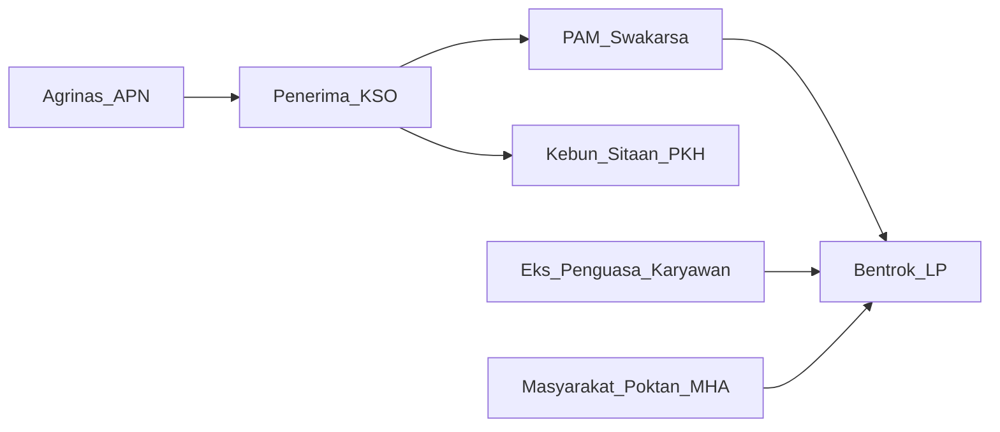

# Laporan 5 Analisis Lanjutan — Agrinas–KSO Polda Riau

**Unit:** Unit II Harda · **Tanggal:** 3 Agustus 2026  
**Workbook:** [`analisis_lanjutan_5_prioritas.xlsx`](analisis_lanjutan_5_prioritas.xlsx)  
**Dasar:** `matriks_agrinas_kso_12_polres.xlsx` + Intelkam/satker  

---

## R1. Matriks skor risiko satker & kebun

### Metodologi singkat
Skor satker (0–100) = klaster tertimbang + sinyal konflik + korban + PAM non-BUJP + kelengkapan data + volume kebun. Band: **KRITIS ≥70 · TINGGI ≥55 · SEDANG ≥35 · RENDAH <35**.

### Ranking satker

| Rank | Polres | Skor | Band | Klaster | Sinyal | Korban | PAM |
|---:|---|---:|---|---:|---:|---:|---:|
| 1 | Rohul | 73.0 | KRITIS | 8.6 | 25 | 20 | 15 |
| 2 | Rohil | 61.7 | TINGGI | 8.6 | 22 | 12 | 15 |
| 3 | Bengkalis | 60.4 | TINGGI | 7.2 | 22 | 14 | 15 |
| 4 | Kampar | 51.4 | SEDANG | 14.5 | 16 | 4 | 15 |
| 5 | Inhu | 44.4 | SEDANG | 5.0 | 18 | 5 | 8 |
| 6 | Dumai | 41.5 | SEDANG | 18.0 | 15 | 6 | 2 |
| 7 | Kuansing | 37.0 | SEDANG | 5.3 | 16 | 3 | 8 |
| 8 | Inhil | 32.9 | RENDAH | 7.7 | 10 | 3 | 8 |
| 9 | Pelalawan | 32.6 | RENDAH | 4.0 | 14 | 8 | 2 |
| 10 | Siak | 17.6 | RENDAH | 4.0 | 6 | 4 | 2 |
| 11 | Kep. Meranti | 9.1 | RENDAH | 4.0 | 2 | 0 | 2 |
| 12 | Pekanbaru | 5.6 | RENDAH | 0 | 1 | 0 | 2 |

### 10 kebun skor tertinggi

| Rank | Polres | Skor | Band | Estate | Klaster |
|---:|---|---:|---|---|---|
| 1 | Rohul | 77 | KRITIS | PT BK 1 / Berkat Satu | Merah |
| 2 | Rohil | 67 | TINGGI | PT Gunung Mas Raya (Rumbia I) | Merah |
| 3 | Bengkalis | 67 | TINGGI | PT Sinar Inti Sawit (SIS) | Merah |
| 4 | Kampar | 50 | TINGGI | PT Sarindo Agro Lestari / Kepau Jaya | Kuning |
| 5 | Rohul | 46 | SEDANG | PT Torganda Tambusai Timur | Kuning |
| 6 | Inhu | 43 | SEDANG | PT Indrawan Perkasa | Kuning |
| 7 | Dumai | 43 | SEDANG | PT Duta Mas Makmur Perkasa | Kuning |
| 8 | Dumai | 43 | SEDANG | PT Sinar Riau Palm Oil | Kuning |
| 9 | Dumai | 43 | SEDANG | PT Pelintung Jaya Bersama | Kuning |
| 10 | Rohul | 40 | SEDANG | PT Togos Gopas / Maju Bersama | Kuning |

**Implikasi R1:** Koridor utara (Rohul–Rohil–Bengkalis) mendominasi band KRITIS/TINGGI. Inhu/Kuansing/Kampar masuk TINGGI karena volume atau LP, meski tanpa MD. Pelalawan naik karena faktor TNTN pada skor korban/aksi — tetap pisahkan analisis KSO vs TNTN saat operasionalisasi.

---

## R3. Validasi klaster Intelkam vs kejadian aktual

Diuji **32** titik estate/portofolio. Rekap status:

| Status | Jml | Arti |
|---|---:|---|
| VALID | 18 | Klaster resmi selaras bukti |
| KANDIDAT_NAIK | 5 | Belum resmi diubah; pantau/usulkan update |
| KOREKSI_NAIK | 3 | Understate — usulan naikkan klaster |
| VALID_DENGAN_CATATAN | 3 | Selaras dengan syarat/pemisahan tipologi |
| PISAHKAN | 1 | Jangan gabung ke klaster KSO |
| TIDAK_DAPAT_DIVALIDASI | 1 | Data lokal kosong |
| DI LUAR OBJEK | 1 | Bukan Agrinas–KSO |

### Yang perlu dikoreksi / dinaikkan

- **V04 Bengkalis — CV Hendrik Padang – Mitra Karya:** resmi `Hijau (resume) / Kuning* (kartu)` → usulan `Kuning` — Resume understate; kartu/Mei2026 tunjukkan konflik tanpa kerusuhan massal berulang
- **V05 Bengkalis — CV Sepakat Bersama Ali:** resmi `Hijau (resume) / Kuning* (kartu)` → usulan `Kuning` — Sama seperti V04
- **V06 Bengkalis — PT Mutiara Naga – PKU/Agrinas:** resmi `Tidak di kartu merah/kuning resmi` → usulan `Kuning→pantau Merah` — Kejadian pasca briefing 12.02; perlu update klaster
- **V13 Kampar — PT Johan Sentosa (lokal hotspot):** resmi `Tidak masuk 4 kartu Intelkam sebagai kuning/merah` → usulan `Kuning` — Diskrepansi Intelkam 4 kebun vs lokal 21 estate
- **V16 Inhu — EX Palm Lestari – Koperasi TKBM:** resmi `Hijau*` → usulan `Kuning` — Hijau understate; ada bentrok aktual
- **V17 Inhu — PT Tunggal Perkasa – JD Karya Mandiri:** resmi `Hijau` → usulan `Hijau pantau / Kuning ringan` — Belum kerusuhan; tuntutan aktif
- **V19 Kuansing — PT Wana Jingga Timur:** resmi `Hijau` → usulan `Kuning (struktural) / Hijau-pidana` — Pisahkan pidana TBS vs tuntutan kelola; struktural → kuning
- **V27 Inhil — PT RSA – Cipta Nugraha:** resmi `Tidak berkaster jelas di resume` → usulan `Kuning ringan` — Perlu masuk radar klaster satker

### Yang harus dipisahkan dari klaster KSO

- **TNTN (bukan kartu KSO)** (Pelalawan): Jangan pakai klaster KSO untuk TNTN

**Implikasi R3:** Definisi merah untuk 3 titik resmi **valid**. Understatement utama ada di Bengkalis (kuning tersembunyi), Inhu EX Palm, Kuansing WJT (dimensi struktural), Kampar Johan Sentosa, dan Mutiara Naga (pasca-briefing).

---

## R2. Jaringan aktor KSO / PAM multi-lokasi

Teridentifikasi **18 hub aktor** (multi-polres, multi-estate, atau flag PAM/KSO risiko). Cuplikan hub utama:

| Aktor | #Polres | Polres | #Estate | Flag | Catatan |
|---|---:|---|---:|---|---|
| Agrinas Palma Nusantara | 5 | Inhu, Kampar, Kuansing, Pelalawan, Rohul | 10 | YA | Multi-lokasi |
| Bernas Mulya Mandiri | 2 | Inhu, Rohul | 5 | YA | Multi-lokasi |
| KSO | 2 | Dumai, Kampar | 5 | YA | Multi-lokasi |
| Agus S Lubis | 1 | Inhu | 2 | YA | Multi-lokasi |
| Belum ada KSO | 1 | Bengkalis | 2 | YA | Multi-lokasi |
| Berlian Nusantara Perkasa | 1 | Pelalawan | 2 | YA | Multi-lokasi |
| Maju Serempak | 1 | Pelalawan | 2 | YA | Multi-lokasi |
| PT Runggu | 1 | Inhu | 2 | YA | Multi-lokasi |
| Poktan Berkah Tani Sejahtera | 1 | Inhil | 2 | YA | Multi-lokasi |
| Poktan Riau Jaya Makmur | 1 | Kampar | 2 | YA | PAM/KSO non-BUJP terkait bentrok |
| PT Nusantara Sawit Majuma | 1 | Rohul | 1 | YA | PAM/KSO non-BUJP terkait bentrok |
| PT Palma Agung Betuah (PAB) | 1 | Bengkalis | 1 | YA | PAM/KSO non-BUJP terkait bentrok |
| PT Riden Jaya Konstruksi | 1 | Dumai | 1 | YA | PAM/KSO non-BUJP terkait bentrok |
| PT Ujung Tanjung Sejahtera | 1 | Rohil | 1 | YA | PAM/KSO non-BUJP terkait bentrok |
| Makmur Jaya Sentosa | 1 | Kampar | 0 | YA | PAM/KSO non-BUJP terkait bentrok |
| Togas | 1 | Rohul | 0 | YA | PAM/KSO non-BUJP terkait bentrok |
| Togos | 1 | Rohul | 0 | YA | PAM/KSO non-BUJP terkait bentrok |
| Torus | 1 | Rohul | 0 | YA | PAM/KSO non-BUJP terkait bentrok |

### Pola jaringan

**Hub risiko prioritas pantau:** Majuma (Rohul), PAB (Bengkalis), UTS (Rohil), Riden Jaya (Dumai/BKS), Bernas Mulya Mandiri (multi-estate Inhu), Berlian NP & Maju Serempak (multi-estate Pelalawan), Poktan Riau Jaya Makmur (multi Kampar).

**Implikasi R2:** Risiko tidak hanya “lokasi”, tetapi **aktor yang berpindah antar kebun**. Penerima multi-estate tanpa rekam mediasi lokal memperbesar peluang penolakan berulang.

---

## R4. Timeline eskalasi (4 pilot)

### Pilot 1 — Majuma / Berkat Satu (Rohul) → MD

- **2025-akhir / pra-2026:** Penunjukan KSO PT Nusantara Sawit Majuma atas lahan PT BK1/Berkat Satu (Sontang, Bonai Darussalam); PAM swakarsa non-BUJP (Nias)
- **2026-01-12:** Bentrok masyarakat 3 desa + PAM Berkat Satu vs PAM Majuma KSO Agrinas (~260 orang); narasi 8 luka
- **2026-01-21:** LP/B/32/I/2026 — penganiayaan terhadap patroli Agrinas+Satgas di Afd IX
- **2026-02-07:** Serangan PAM Majuma ke barak/PAM KUD Telago Biru / Berkat Satu; **1 MD + 6 luka**; LP/B/07/II/2026 Polsek Bonai
- **2026-02-22:** LP/B/21/II/2026 Tambusai — massa ~400 paksa masuk mess Afd VIII Tambusai Timur (konteks Torganda/Agrinas paralel)
- **2026-02-12..23:** Update Intelkam: daftar tersangka Majuma (jumlah berbeda antar deck 12.02 vs 23.02)
- **2026-03-31:** LP/B/107/III/2026 — pencurian TBS Agrinas eks Torganda Afd XII (lanjutan ketegangan panen)
- **Window kritis:** ≈ 4–8 minggu dari gesekan Jan menuju MD Feb; pengamanan non-BUJP = akselerator

### Pilot 2 — PAB–SIS (Bengkalis) → eskalasi berulang

- **pra-Des 2025:** Lahan PT SIS disita Satgas PKH; KSO PT Palma Agung Betuah (PAB); PAM Nias & Sakai non-BUJP
- **2025-12-03:** Bentrok karyawan SIS vs masyarakat Sakai; 1 warga luka kepala
- **2025-12-22:** Bentrok PAB vs SIS saat PAB masuk lahan sitaan; luka bacok; 13 mobil dirusak; LP 476/XII/2025 & LP/B/153/XII/2025
- **2026-01-14:** Warga Bukit Abas vs security PAB → bakar Pos 1; 2 LP; 5 tersangka
- **2026-04..05:** Manajemen PAB berjalan; ketegangan dengan pok H. Rusman/Risman Tobing; panen liar ~150 Ha
- **2026-05-15/16:** Penganiayaan/pembakaran motor; LP/219/V/2026 (PAB) & LP/B/59/V/2026 (kubu Tobing)
- **2026-07-28/29:** Kasus paralel Mutiara Naga–PKU: mediasi gagal → bentrok (sinyal pola sama di Bengkalis)
- **Window kritis:** Eskalasi berulang 6+ bulan di lokasi sama; mediasi tanpa penyelesaian legitimasi kelola gagal meredam

### Pilot 3 — UTS / Gunung Mas Raya (Rohil) → 7 luka

- **pra-Okt 2025:** KSO PT Ujung Tanjung Sejahtera atas Ex Rumbia I / PT Gunung Mas Raya (~1.800 Ha); PAM Flores non-BUJP
- **2025-10-20:** Kelompok W. Siringo-Ringo panen sepihak Blok 29–30 vs security UTS (air cabai); **7 luka**; RJ
- **pasca RJ:** Klaster tetap MERAH di Intelkam Feb 2026; penolakan KSO di kebun kuning lain Rohil berlanjut (Ivomas, APSL, Rama Salomo)
- **Gap:** 3 LP Agrinas Rohil disebut agregat Bismillah — nomor belum teritemisasi di sumber workspace
- **Window kritis:** Eskalasi cepat ke kekerasan fisik pada episode panen; RJ menutup perkara tetapi tidak menghapus klaster merah

### Pilot 4 — DMMP–Riden Jaya (Dumai) → take-over

- **pra-2026:** PT Duta Mas Makmur Perkasa sitaan PKH ±1.458,7 Ha (split ~1000 Ha Bengkalis + ~458,7 Ha Dumai)
- **penunjukan KSO:** KSO PT Riden Jaya Konstruksi
- **pra-20 Feb 2026:** Aksi penghadangan karyawan DMMP terhadap karyawan Riden Jaya
- **2026-02-20:** Riden Jaya turun lapangan take-over lahan sitaan; bentrok/tumpang tindih kelola
- **Intelkam Feb 2026:** Masuk klaster KUNING bersama SRPO & Pelintung Jaya (perebutan pekerjaan)
- **Window kritis:** Take-over fisik tanpa konsensus tenaga kerja lama → bentrok; risiko double-count BKS–Dumai

### Pola lead-time lintas pilot

| Pilot | Pemicu awal | Waktu ke kekerasan signifikan | Akselerator |
|---|---|---|---|
| Majuma | Penolakan KSO + PAM tandingan | ≈ 3–4 minggu (Jan→7 Feb) | PAM non-BUJP, mobilisasi massal |
| PAB–SIS | Masuk lahan sitaan vs eks-karyawan | Hari/minggu; berulang 6+ bulan | Dual LP, PAM, klaim hak kelola |
| UTS | Panen sepihak vs security | Episode tunggal cepat (20 Okt) | PAM non-BUJP, sengketa panen |
| DMMP | Penghadangan → take-over | Menjelang aksi 20 Feb | Split wilayah BKS–Dumai, tenaga kerja lama |

**Implikasi R4:** Window pengawasan paling kritis adalah **30 hari setelah penunjukan KSO / first entry** ke lahan sitaan, terutama jika PAM non-BUJP dan eks-karyawan masih menguasai operasional.

---

## R5. Gap-fill data satker tipis

### Pelalawan — daftar KSO (9 teridentifikasi + 1 gap)

| ID | Eks perusahaan | Penerima KSO | Sita Ha | Lokasi | Status data |
|---|---|---|---:|---|---|
| PKSO-01 | Mitra Unggul Pusaka | Kop. Karya Indragiri Maju | 366.8 | Segati/Langgam | Perlu LP satker |
| PKSO-02 | Sari Lembah Subur | Maju Serempak | 681.01 | Genduang | Perlu LP satker |
| PKSO-03 | Mekar Sari Alam Lestari | Berlian Nusantara Perkasa | 4745 | Mak Teduh | Perlu LP satker |
| PKSO-04 | Serikat Putra | Agrinas | 138 | Sialang Godang | Perlu LP satker |
| PKSO-05 | Gandaerah Hendana (bagian Pelalawan) | Berlian Nusantara Perkasa | 10 | Kerumutan | Sebagian luas di Inhu |
| PKSO-06 | Eka Sari Lorena | Kop. Segati Sejahtera | 127 | Segati | Perlu LP satker |
| PKSO-07 | Guna Dodos | Maju Serempak | 5 | Sei Kijang | Perlu LP satker |
| PKSO-08 | Agrita Sari Prima | Kop. Desa Segati | 111.82 | Segati | Perlu LP satker |
| PKSO-09 | Viktorindo Alam Lestari | Poktan LMMB | 85 | Palas, PKL Kuras | Perlu LP satker |
| PKSO-10 | Agregat lokal '10 KSO' (nama ke-10 belum di Intelkam cards) | BELUM TERIDENTIFIKASI | 5392.83 | Kab. Pelalawan | Minta Polres/Disbun isi nama KSO ke-10 |

### Rohil — register gap LP / KSO

- **RGAP-01** [TERCATAT_TANPA_NOMOR]: Bentrok UTS–Siringo 20 Okt 2025 — tindak lanjut: Minta Polres Rohil kirim nomor LP/RJ resmi
- **RGAP-02** [KOSONG]: LP Agrinas #1 (agregat Bismillah=3) — tindak lanjut: Itemisasi wajib
- **RGAP-03** [KOSONG]: LP Agrinas #2 (agregat Bismillah=3) — tindak lanjut: Itemisasi wajib
- **RGAP-04** [KOSONG]: LP Agrinas #3 (agregat Bismillah=3) — tindak lanjut: Itemisasi wajib
- **RGAP-05** [PARSIAL]: Daftar 8 KSO Rohil (hanya hitungan) — tindak lanjut: Lengkapi 8 nama resmi dari Agrinas/Polres
- **RGAP-06** [AGGREGAT_SAJA]: Pengaduan masyarakat 194 (agregat) — tindak lanjut: Sample 20 pengaduan terkait KSO/Agrinas

### Ringkasan gap & aksi

| Polres | Gap | Aksi |
|---|---|---|
| Kep. Meranti | NIHIL total + file Tebing Tinggi corrupt | Kirim template TMPL-MER; minta konfirmasi tertulis NIHIL atau isi 1 kebun Intelkam |
| Pekanbaru | Agrinas NIHIL jelas; 7 LP pencurian non-Agrinas | Pertahankan status NIHIL Agrinas; jangan campur ke skor KSO |
| Rohil | 24 kebun / 8 KSO / 3 LP Agrinas tanpa nomor | Itemisasi LP + lengkapi nama KSO |
| Pelalawan | 9/10 KSO teridentifikasi dari Intelkam; LP tipis; TNTN terpisah | Isi KSO#10 + LP bernomor; pisah register TNTN |
| Siak | Kolom luas kacau; HTI tercampur | Template filter sawit PKH; verifikasi Ha |

Template isian detail ada di sheet `R5_template_isian` (Meranti, Siak, Rohil, Pelalawan).

---

## Sintesis lintas 5 analisis

1. **Skor risiko** dan **validasi klaster** saling mengunci: Rohul/Rohil/Bengkalis kritis; sejumlah hijau perlu naik.
2. **Jaringan aktor** menjelaskan mengapa eskalasi menular antar kebun (PAM/KSO yang sama atau pola penunjukan serupa).
3. **Timeline** memberi window 30 hari sebagai fokus monitoring analitik pasca-entry KSO.
4. **Gap-fill** adalah prasyarat agar skor R1 untuk Rohil/Pelalawan/Siak/Meranti tidak bias karena data hilang.

### Prioritas kerja analitik berikutnya (urut)

1. Update klaster untuk item KOREKSI_NAIK / KANDIDAT_NAIK (R3)
2. Isi RGAP Rohil + PKSO-10 Pelalawan (R5)
3. Perdalam network Majuma–PAB–UTS–Riden + Bernas Mulya (R2)
4. Pantau window 30 hari untuk setiap penunjukan KSO baru (R4)
5. Refresh skor R1 bulanan setelah gap terisi

*Dokumen analitik Unit II Harda — bukan rekomendasi taktis operasi.*
